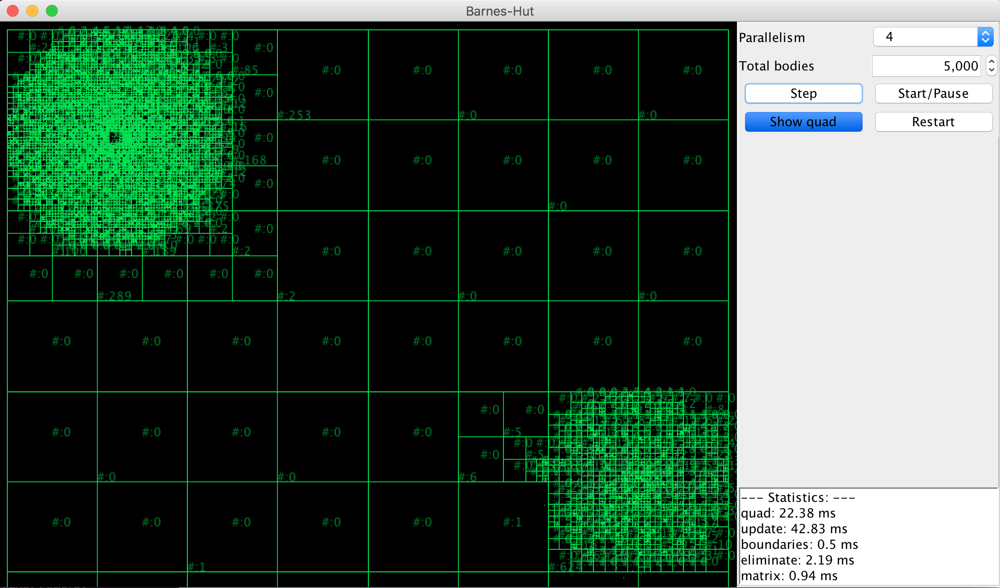

# Barnes-Hut-Simulation

[](https://travis-ci.org/tadjik1/Barnes-Hut-Simulation)

Parallel [Barnes-Hut algorithm](https://en.wikipedia.org/wiki/Barnes%E2%80%93Hut_simulation) for N-body simulation.
Programming assignment for Week 4 ["Parallel programming"](https://www.coursera.org/learn/parprog1/home/welcome) course on coursera.org.



## Installation

Clone this repository and run `sbt "run-main barneshut.BarnesHut"`

## Description

N-body simulation is a simulation of a system of N particles that interact with physical forces,
such as gravity or electrostatic force. Given initial positions and velocities of all
the particles (or bodies), the N-body simulation computes the new positions and velocities of
the particles as the time progresses. It does so by dividing time into discrete short intervals,
and computing the positions of the particles after each interval.

#### The direct sum N-body algorithm

The direct sum algorithm consists of multiple iterations, each of which performs the following
steps for each particle:

1. The particle position is updated according to its current velocity (delta is a short time period).

    ```
    x' = x + v_x * delta` `y' = y + v_y * delta
    ```
2. The net force on the particle is computed by adding the individual forces from all
the other particles. 
    
    ```
    F_x = F_1x + F_2x + F_3x + ... + F_Nx` `F_y = F_1y + F_2y + F_3y + ... + F_Ny
    ```
    
    *Note: in this assignment we assume that the force between particles is the gravitational force from classical mechanics.*
        ```
        F = G * (m1 * m2) / distance^2
        ```
3. The particle velocity is updated according to the net force on that particle.

    ```
    v_x' = v_x + F_x / mass * delta` `v_y' = v_y + F_y / mass * delta
    ```

The direct sum N-body algorithm is very simple, but also inefficient. Since we need to update
N particles, and compute N - 1 force contributions for each of those particles, the overall complexity
of an iteration step of this algorithm is O(N^2). As the number of particles grows larger, the direct
sum N-body algorithm becomes prohibitively expensive.

#### The Barnes-Hut algorithm

The Barnes-Hut algorithm is an optimization of the direct sum N-body algorithm, and is based on the
following observation:
```
If a cluster of bodies is sufficiently distant from a body A, the net force on A from that cluster can be
approximated with one big body with the mass of all the bodies in the cluster, positioned at the center
of mass of the cluster.
```

To take advantage of this observation, the Barnes-Hut algorithm relies on a quadtree — a data structure
that divides the space into cells, and answers queries such as 'What is the total mass and the center of mass
of all the particles in this cell?'.